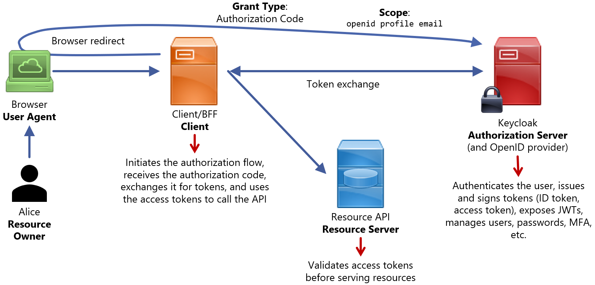

# OAuth 2.0/OIDC Demo
It uses Keycloak as OAuth server.
- It avoids CORS issues
- It avoids putting OAuth secrets in JavaScript

It then runs a resource API and a server acting as the API's client (BFF: Backend-for-Frontend).



## Usage
1. Configure Keycloak (download, run it on `http://localhost:8080`, create an admin account, a realm, a client, and a user)
    - Open a terminal and run
        ```
        docker run --name keycloak-demo -p 8080:8080 ^
          -e KEYCLOAK_ADMIN=admin ^
          -e KEYCLOAK_ADMIN_PASSWORD=admin ^
          quay.io/keycloak/keycloak:24.0 start-dev
        ```
    - Open a browser and go to `http://localhost:8080`
    - Click **Administration Console** and log in as `admin / admin`
    - In the top-left dropdown (**Keycloak**), click on **Create realm**. Realm name: `demo`
    - Left menu: **Clients**, then click on **Create client**:
        - Client type: **OpenID Connect**
        - ClientID: `demo-client`
        - Click on **Next**
        - Check **Client authentication**, **Standard flow**. Make sure **Implicit flow**, **OAuth 2.0 Device Authorization Grant** and **OIDC CIBA Grant** are left unchecked
        - Click on **Next**
        - Valid redirect URIs: `http://localhost:5500/callback`
        - Web origins: `http://localhost:5500`
        - Click on **Save**
    - Left menu: **Clients**, then click on `demo-client`
        - Click on the **Credentials** tab
        - Copy the **Client Secret**
    - Left menu: **Users**, then click on **Add user**
        - Username: `alice`
        - Email: `alice@mail.com`
        - First name: `Alice`
        - Last name: `Wonder`
        - Click on **Create**
        - Click on the **Credentials** tab
        - Password: `secret`
        - Set **Temporary** off
2. Prepare the demo project 
    - Run `npm i` in `client-bff` and `resource-api`
    - Create config files by copying `.env.example` to `.env` in `client-bff` and `resource-api`
    - In `client-bff/.env`, update `OIDC_CLIENT_SECRET`: Substitute `CHANGE_ME` by the client secret from Keycloak
3. Start both servers
    - In `resource-api`, run `npm start`. The resource server will be available at `http://localhost:9000`
    - In `client-bff`, run `npm start`. The Client/BFF will be available at `http://localhost:5500`
4. Run the demo
    - Open a browser at `http://localhost:5500`
    - Click on **Login via OIDC**
        - The BFF redirects the browser to Keycloak's `/authorize` endpoint
        - Keycloak shows a login form. Log in as `alice / secret`
        - Keycloak redirects back to `http://localhost:5500/callback?code=...&state=...`
        - The BFF exchanges `code` for tokens at Keycloak's `/token` endpoint
        - The page reloads and shows `access_token`, `id_token` and raw JWTs
    - Click on **Call Resource API**
        - The BFF sends `Authorization: Bearer <access_token>` to `http://localhost:9000/secret`
        - The API fetches Keycloak's public keys, checks who the token was issued for, and returns protected data


## Tools
Express / Node.js / JavaScript / Water.css / CSS3 / HTML5

## Author
ChatGPT 5.2, prompted by Arturo Mora-Rioja.